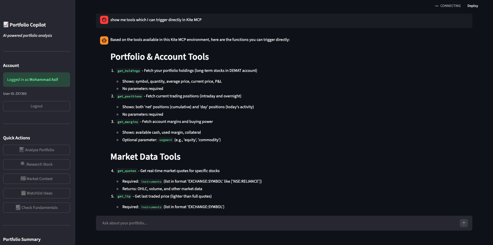
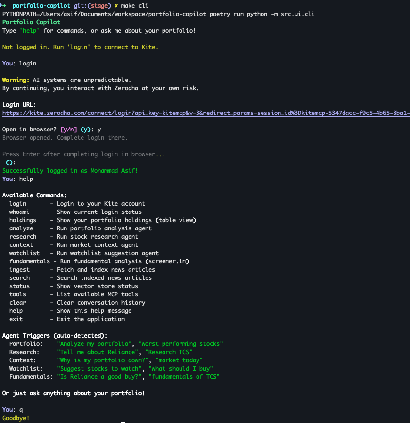

# Portfolio Copilot

An AI-powered portfolio analysis assistant for Zerodha Kite users, built to learn MCP + LLM + RAG + Agentic AI fundamentals.
Ask questions about your portfolio in plain English and get intelligent analysis powered by Claude.

## What It Does

- **Portfolio Analysis** - Identify your best/worst performers with context
- **Stock Research** - Get comprehensive research on any stock
- **Market Context** - Understand why your portfolio moved
- **Fundamental Analysis** - Buy/hold/sell recommendations using screener.in data
- **Watchlist Suggestions** - Discover stocks based on your investment style

## Screenshots

### Web Interface (Streamlit)



*Chat interface with suggested prompts, Kite login sidebar, and real-time responses*

### CLI Interface (Rich)



*Terminal-based interface with rich formatting and command support*

## Quick Start

### Prerequisites

- Python 3.12+
- [Poetry](https://python-poetry.org/docs/#installation)
- Zerodha Kite account
- [Anthropic API key](https://console.anthropic.com/)

### Installation

```bash
git clone https://github.com/mohdasif2294/portfolio-copilot.git
cd portfolio-copilot
poetry install
cp .env.example .env
```

Add your Anthropic API key to `.env`:

```bash
ANTHROPIC_API_KEY=sk-ant-xxx
```

### Run

**Web Interface (Recommended)**

```bash
make web
```

Opens a Streamlit web app at http://localhost:8501 with:
- Chat interface with suggested prompts
- Sidebar for Kite login and quick actions
- Real-time streaming responses

**CLI Interface**

```bash
make cli
```

```
Portfolio Copilot
Type 'help' for commands, or ask me about your portfolio!

You> login                              # Connect to Zerodha
You> holdings                           # View portfolio table
You> Is TCS a good buy?                 # Fundamental analysis
You> Why is my portfolio down today?    # Market context
You> Tell me about Reliance             # Stock research
```

## Usage

### Commands

| Command | Description |
|---------|-------------|
| `login` | Connect to your Zerodha account |
| `holdings` | View portfolio table |
| `analyze` | Portfolio analysis |
| `research` | Stock research |
| `fundamentals` | Fundamental analysis |
| `ingest` | Index news articles |
| `help` | Show all commands |

### Natural Language

Just ask questions naturally - the system auto-detects intent:

```
You> What are my worst performing stocks?
You> Tell me about Reliance
You> Why is my portfolio down today?
You> Is TCS a good buy?
You> Suggest stocks for my watchlist
```

## Agents

| Agent | Purpose |
|-------|---------|
| **Portfolio Analysis** | Analyzes holdings, identifies best/worst performers, fetches relevant news |
| **Stock Research** | Researches individual stocks with price data, news, and your position |
| **Market Context** | Explains why your portfolio moved using market news and trends |
| **Watchlist Suggestion** | Recommends stocks based on your current sectors and blue chips |
| **Fundamental Analysis** | Evaluates stocks using screener.in metrics (P/E, ROE, debt) with buy/hold/sell scores |

## Architecture

```
┌─────────────────────────────────────────────────────────────┐
│              User Interface Layer                            │
│  ┌─────────────────────┐    ┌─────────────────────┐         │
│  │  Web UI (Streamlit) │    │   CLI (Rich)        │         │
│  │  - Chat interface   │    │   - Commands        │         │
│  │  - Suggested prompts│    │   - REPL interface  │         │
│  │  - Login sidebar    │    │                     │         │
│  └─────────────────────┘    └─────────────────────┘         │
└──────────────────────────┬──────────────────────────────────┘
                           │
┌──────────────────────────▼──────────────────────────────────┐
│                   Agent Orchestrator                         │
│            (Query detection & routing)                       │
└────────┬─────────────┬─────────────┬─────────────┬──────────┘
         │             │             │             │
         ▼             ▼             ▼             ▼
┌─────────────┐ ┌─────────────┐ ┌─────────────┐ ┌─────────────┐
│  Portfolio  │ │   Stock     │ │   Market    │ │ Fundamental │
│  Analysis   │ │  Research   │ │   Context   │ │  Analysis   │
│   Agent     │ │   Agent     │ │   Agent     │ │   Agent     │
└─────────────┘ └─────────────┘ └─────────────┘ └─────────────┘
         │             │             │             │
         └─────────────┴──────┬──────┴─────────────┘
                              │
         ┌────────────────────┼────────────────────┐
         │                    │                    │
         ▼                    ▼                    ▼
┌─────────────────┐  ┌─────────────────┐  ┌─────────────────┐
│   Kite MCP      │  │   RAG System    │  │  Screener.in    │
│   (Holdings,    │  │   (ChromaDB +   │  │   (Fundamental  │
│    Quotes)      │  │    News)        │  │    Data)        │
└─────────────────┘  └─────────────────┘  └─────────────────┘
                              │
                              ▼
                    ┌─────────────────┐
                    │   Claude LLM    │
                    │   (Synthesis)   │
                    └─────────────────┘
```

## Tech Stack

| Component | Technology |
|-----------|------------|
| Language | Python 3.12 |
| LLM | Claude Sonnet 4 (Anthropic) |
| Agent Framework | LangGraph |
| Vector Database | ChromaDB |
| Embeddings | Sentence Transformers (all-MiniLM-L6-v2) |
| Broker Integration | Zerodha Kite MCP |
| Web UI | Streamlit |
| CLI | Rich |
| Web Scraping | BeautifulSoup4, httpx |

## Disclaimer

This tool is for **educational purposes only**. It is NOT investment advice. Always consult a qualified financial advisor before making investment decisions.

## License

MIT
