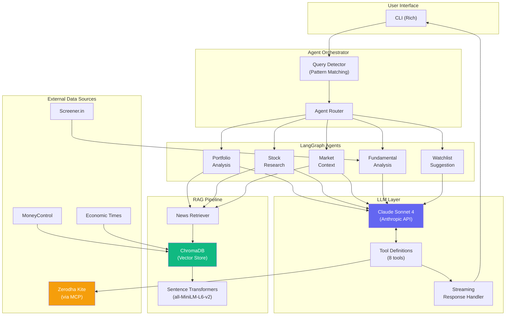
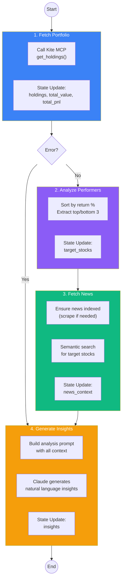
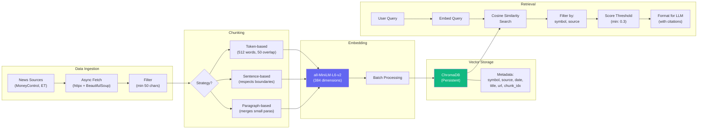
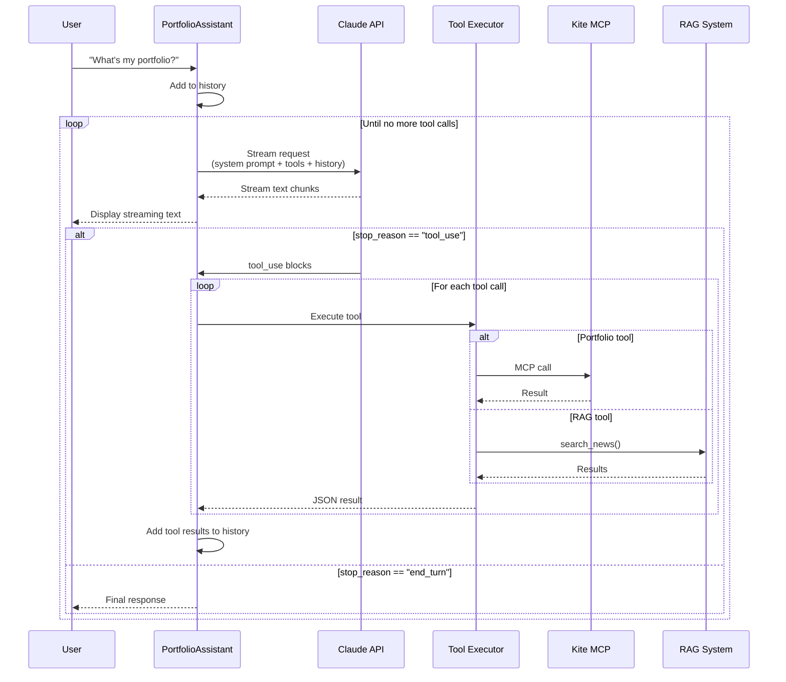
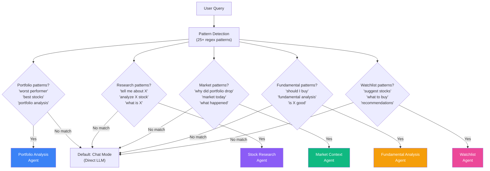
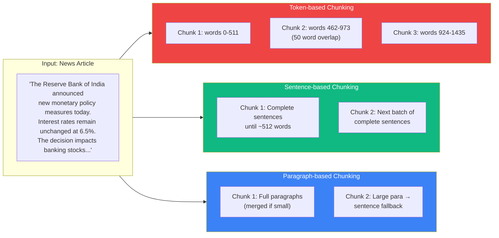
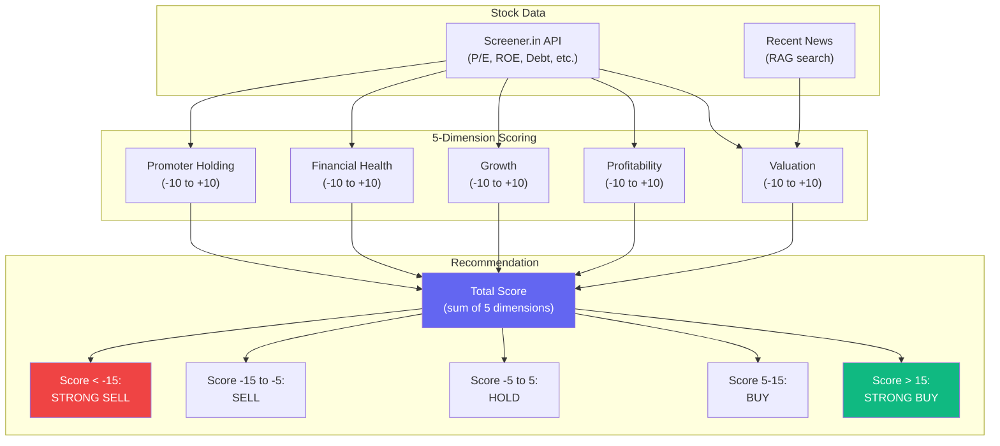

# Diagrams for Medium Article

Render these at [mermaid.live](https://mermaid.live) and export as PNG/SVG for your article.

---

## 1. Overall System Architecture



---

## 2. LangGraph Workflow: Portfolio Analysis Agent



**State Schema:**
```python
class PortfolioState(TypedDict):
    query: str
    analysis_type: str        # "best" | "worst"
    holdings: list            # From Kite MCP
    total_value: float
    total_pnl: float
    target_stocks: list       # Top/bottom performers
    news_context: list        # From RAG
    insights: str             # Final LLM output
    error: str | None
    steps_completed: list     # Audit trail
```

---

## 3. RAG Pipeline Flowchart



---

## 4. Tool Calling Loop (LLM Integration)



**Tool Definitions (8 total):**
```
Portfolio Tools (6):
├── get_holdings      - DEMAT holdings
├── get_positions     - Trading positions
├── get_margins       - Account margins
├── get_quotes        - Real-time quotes
├── get_ltp           - Last traded price
└── search_instruments - Symbol search

RAG Tools (2):
├── search_news       - Semantic search
└── ingest_stock_news - Fetch & index news
```

---

## 5. Query Routing / Orchestrator



---

## 6. Chunking Strategies Comparison



| Strategy | Pros | Cons | Best For |
|----------|------|------|----------|
| **Tokens** | Consistent size, predictable | May split mid-sentence | Large documents, batch processing |
| **Sentences** | Preserves meaning | Variable chunk sizes | News articles, Q&A |
| **Paragraphs** | Preserves context | Can be too large | Long-form content, reports |

---

## 7. Fundamental Analysis Scoring



---

## How to Export for Medium

1. **Go to [mermaid.live](https://mermaid.live)**
2. **Paste each diagram code** (between the ```mermaid tags)
3. **Click "Actions" → "Export PNG"** (or SVG for crisp scaling)
4. **Recommended settings:**
   - Background: White or Transparent
   - Scale: 2x for retina displays
5. **Upload to Medium** using the image upload feature

---

## Alternative: ASCII Diagrams

If you prefer simple ASCII for code blocks:

### Tool Calling Loop (ASCII)
```
┌─────────┐    ┌─────────────┐    ┌──────────┐
│  User   │───▶│  Assistant  │───▶│  Claude  │
└─────────┘    └─────────────┘    └──────────┘
                     │                  │
                     │   tool_use?      │
                     │◀─────────────────┤
                     │                  │
                     ▼                  │
              ┌─────────────┐           │
              │Tool Executor│           │
              └─────────────┘           │
                     │                  │
        ┌────────────┼────────────┐     │
        ▼            ▼            ▼     │
   ┌────────┐  ┌──────────┐  ┌─────┐   │
   │Kite MCP│  │RAG Search│  │ ... │   │
   └────────┘  └──────────┘  └─────┘   │
        │            │            │     │
        └────────────┼────────────┘     │
                     │                  │
                     │  tool_results    │
                     │─────────────────▶│
                     │                  │
                     │   final text     │
                     │◀─────────────────┤
                     ▼
               ┌─────────┐
               │  User   │
               └─────────┘
```

### RAG Pipeline (ASCII)
```
INGESTION:
┌──────────────┐   ┌─────────┐   ┌──────────┐   ┌──────────┐   ┌──────────┐
│ News Sources │──▶│  Fetch  │──▶│  Filter  │──▶│  Chunk   │──▶│  Embed   │
│ (MC, ET)     │   │ (async) │   │ (>50chr) │   │ (512w)   │   │ (384d)   │
└──────────────┘   └─────────┘   └──────────┘   └──────────┘   └──────────┘
                                                                     │
                                                                     ▼
                                                              ┌──────────┐
                                                              │ ChromaDB │
                                                              │ + meta   │
                                                              └──────────┘
                                                                     │
RETRIEVAL:                                                           │
┌───────────┐   ┌─────────┐   ┌──────────┐   ┌──────────┐           │
│   Query   │──▶│  Embed  │──▶│  Search  │◀──────────────────────────┘
│           │   │         │   │ (cosine) │
└───────────┘   └─────────┘   └──────────┘
                                   │
                                   ▼
                            ┌──────────────┐
                            │ Filter/Score │
                            │ (>0.3, meta) │
                            └──────────────┘
                                   │
                                   ▼
                            ┌──────────────┐
                            │ Format for   │
                            │     LLM      │
                            └──────────────┘
```

---

## 8. CLI Mockups

Use these for your Medium article to show the application in action.

### Startup & Login Flow

```
┌──────────────────────────────────────────────────────────────────────────────┐
│ Terminal - Portfolio Copilot                                                 │
├──────────────────────────────────────────────────────────────────────────────┤
│                                                                              │
│  $ python -m src.ui.cli                                                      │
│                                                                              │
│  Portfolio Copilot                                                           │
│  Type 'help' for commands, or ask me about your portfolio!                   │
│                                                                              │
│  Not logged in. Run 'login' to connect to Kite.                              │
│                                                                              │
│  You: login                                                                  │
│  ⠋ Getting login URL...                                                      │
│                                                                              │
│  Warning: AI systems are unpredictable.                                      │
│  By continuing, you interact with Zerodha at your own risk.                  │
│                                                                              │
│  Login URL: https://kite.zerodha.com/connect/login?...                       │
│                                                                              │
│  Open in browser? [y/n] (y): y                                               │
│  Browser opened. Complete login there.                                       │
│                                                                              │
│  Press Enter after completing login in browser...                            │
│  ⠋ Verifying login...                                                        │
│  Successfully logged in as Asif Khan!                                        │
│                                                                              │
│  You: █                                                                      │
│                                                                              │
└──────────────────────────────────────────────────────────────────────────────┘
```

### Holdings Display

```
┌──────────────────────────────────────────────────────────────────────────────┐
│ Terminal - Portfolio Copilot                                                 │
├──────────────────────────────────────────────────────────────────────────────┤
│                                                                              │
│  You: holdings                                                               │
│  ⠋ Fetching holdings from Kite...                                            │
│                                                                              │
│  ┌─────────────────────── Portfolio Holdings ────────────────────────┐       │
│  │ Symbol      │  Qty │ Avg Price │    LTP │       P&L │  Change % │       │
│  ├─────────────┼──────┼───────────┼────────┼───────────┼───────────┤       │
│  │ RELIANCE    │   10 │   2,450.00│ 2,892.50│   +4,425.00│    +1.23% │       │
│  │ TCS         │    5 │   3,200.00│ 4,125.75│   +4,628.75│    +0.85% │       │
│  │ INFY        │   15 │   1,450.00│ 1,523.40│   +1,101.00│    -0.42% │       │
│  │ HDFCBANK    │    8 │   1,650.00│ 1,712.30│     +498.40│    +0.65% │       │
│  │ GABRIEL     │  100 │     425.00│   312.50│ -11,250.00│    -2.15% │       │
│  │ TATAMOTORS  │   20 │     650.00│   892.40│   +4,848.00│    +1.87% │       │
│  └─────────────┴──────┴───────────┴────────┴───────────┴───────────┘       │
│                                                                              │
│  You: █                                                                      │
│                                                                              │
└──────────────────────────────────────────────────────────────────────────────┘
```

### Portfolio Analysis Agent

```
┌──────────────────────────────────────────────────────────────────────────────┐
│ Terminal - Portfolio Copilot                                                 │
├──────────────────────────────────────────────────────────────────────────────┤
│                                                                              │
│  You: What are my worst performing stocks?                                   │
│                                                                              │
│  Using Portfolio Analysis                                                    │
│  ⠋ Running agent workflow...                                                 │
│                                                                              │
│  ══════════════════════════════════════════════════════════════════════════  │
│                                                                              │
│  ## Portfolio Analysis: Worst Performers                                     │
│                                                                              │
│  Based on your current holdings, here are your **3 worst performing**        │
│  stocks by return percentage:                                                │
│                                                                              │
│  | Stock    | Return   | P&L         | Qty |                                 │
│  |----------|----------|-------------|-----|                                 │
│  | GABRIEL  | -26.5%   | -₹11,250.00 | 100 |                                 │
│  | YESBANK  | -18.2%   | -₹3,640.00  | 200 |                                 │
│  | VEDL     | -12.8%   | -₹1,920.00  | 50  |                                 │
│                                                                              │
│  ### Key Insights                                                            │
│                                                                              │
│  **GABRIEL (-26.5%)**: Auto ancillary stocks have faced headwinds due        │
│  to weak Q3 results. Recent news indicates margin pressure from raw          │
│  material costs. Consider averaging down if fundamentals remain intact.      │
│                                                                              │
│  **YESBANK (-18.2%)**: Banking sector uncertainty continues. The stock       │
│  has been volatile following RBI's recent commentary on asset quality.       │
│                                                                              │
│  **VEDL (-12.8%)**: Metal prices correction and global demand concerns       │
│  have impacted commodity stocks. Seasonal recovery expected in Q4.           │
│                                                                              │
│  ══════════════════════════════════════════════════════════════════════════  │
│                                                                              │
│  You: █                                                                      │
│                                                                              │
└──────────────────────────────────────────────────────────────────────────────┘
```

### Fundamental Analysis Agent

```
┌──────────────────────────────────────────────────────────────────────────────┐
│ Terminal - Portfolio Copilot                                                 │
├──────────────────────────────────────────────────────────────────────────────┤
│                                                                              │
│  You: fundamentals                                                           │
│  Which stock to analyze? (Is Reliance a good buy?): Should I buy TCS?        │
│                                                                              │
│  Fundamental Analysis Agent                                                  │
│  ⠋ Fetching fundamentals from screener.in...                                 │
│                                                                              │
│  ══════════════════════════════════════════════════════════════════════════  │
│                                                                              │
│  ## Fundamental Analysis: TCS                                                │
│                                                                              │
│  ### Scoring Breakdown                                                       │
│                                                                              │
│  | Dimension         | Score | Notes                        |                │
│  |-------------------|-------|------------------------------|                │
│  | Valuation         |  +2   | P/E 28.5 (industry avg: 25)  |                │
│  | Profitability     |  +8   | ROE 45%, ROCE 52% (strong)   |                │
│  | Growth            |  +4   | Revenue CAGR 12%, steady     |                │
│  | Financial Health  |  +7   | Debt-free, strong cash flow  |                │
│  | Promoter Holding  |  +6   | 72% promoter stake, stable   |                │
│  |-------------------|-------|------------------------------|                │
│  | **Total**         | **+27** |                            |                │
│                                                                              │
│  ### Recommendation: ✅ STRONG BUY                                           │
│                                                                              │
│  TCS demonstrates excellent fundamentals with industry-leading               │
│  profitability metrics and zero debt. The premium valuation is               │
│  justified by consistent execution and strong cash generation.               │
│                                                                              │
│  **Recent News Context:**                                                    │
│  - Q3 results beat estimates with 8.2% YoY profit growth                     │
│  - Won $500M deal with UK-based financial services firm                      │
│  - Management guides for continued momentum in BFSI vertical                 │
│                                                                              │
│  ══════════════════════════════════════════════════════════════════════════  │
│                                                                              │
│  You: █                                                                      │
│                                                                              │
└──────────────────────────────────────────────────────────────────────────────┘
```

### News Ingestion & RAG Search

```
┌──────────────────────────────────────────────────────────────────────────────┐
│ Terminal - Portfolio Copilot                                                 │
├──────────────────────────────────────────────────────────────────────────────┤
│                                                                              │
│  You: ingest                                                                 │
│  Stock symbols (comma-separated, or empty for general news): RELIANCE, TCS   │
│  ⠋ Fetching and indexing news...                                             │
│                                                                              │
│  Ingestion complete!                                                         │
│    Articles fetched: 24                                                      │
│    Chunks stored: 67                                                         │
│                                                                              │
│  You: search                                                                 │
│  Search query: Reliance quarterly results                                    │
│  ⠋ Searching...                                                              │
│                                                                              │
│  Found 5 results:                                                            │
│                                                                              │
│  1. Reliance Q3 Results: Net Profit Rises 18% to ₹18,549 Crore               │
│     Source: MoneyControl | Score: 0.89                                       │
│     Reliance Industries reported an 18% year-on-year rise in                 │
│     consolidated net profit to ₹18,549 crore for Q3 FY24...                  │
│                                                                              │
│  2. RIL's Retail and Jio Drive Growth Amid Refining Weakness                 │
│     Source: EconomicTimes | Score: 0.82                                      │
│     The oil-to-telecom conglomerate saw its consumer businesses              │
│     offset weakness in the traditional O2C segment...                        │
│                                                                              │
│  3. Reliance Industries: Analysts Upgrade Target Price Post Q3               │
│     Source: MoneyControl | Score: 0.76                                       │
│     Following strong Q3 results, brokerages have revised their               │
│     target prices for RIL, with consensus now at ₹3,100...                   │
│                                                                              │
│  You: █                                                                      │
│                                                                              │
└──────────────────────────────────────────────────────────────────────────────┘
```

### Market Context Agent

```
┌──────────────────────────────────────────────────────────────────────────────┐
│ Terminal - Portfolio Copilot                                                 │
├──────────────────────────────────────────────────────────────────────────────┤
│                                                                              │
│  You: Why did my portfolio drop today?                                       │
│                                                                              │
│  Using Market Context                                                        │
│  ⠋ Running agent workflow...                                                 │
│                                                                              │
│  ══════════════════════════════════════════════════════════════════════════  │
│                                                                              │
│  ## Market Context Analysis                                                  │
│                                                                              │
│  Your portfolio is down **₹12,450 (-1.47%)** today.                          │
│                                                                              │
│  ### Market Overview                                                         │
│  - **NIFTY 50:** -1.82% (22,147.50)                                          │
│  - **SENSEX:** -1.75% (73,128.45)                                            │
│  - **BANKNIFTY:** -2.10% (46,892.30)                                         │
│                                                                              │
│  ### Biggest Losers in Your Portfolio Today                                  │
│  | Stock      | Day Change | Impact    |                                     │
│  |------------|------------|-----------|                                     │
│  | HDFCBANK   | -2.85%     | -₹4,890   |                                     │
│  | RELIANCE   | -1.65%     | -₹4,772   |                                     │
│  | TCS        | -0.92%     | -₹1,897   |                                     │
│                                                                              │
│  ### What's Happening                                                        │
│                                                                              │
│  The broader market selloff is driven by:                                    │
│                                                                              │
│  1. **Global cues**: US Fed's hawkish commentary on interest rates           │
│     triggered risk-off sentiment across emerging markets.                    │
│                                                                              │
│  2. **FII Outflows**: Foreign investors sold ₹3,200 crore in cash            │
│     segment today, continuing the January selling trend.                     │
│                                                                              │
│  3. **Banking Sector Pressure**: RBI's draft norms on project                │
│     financing hit banking stocks hardest, explaining HDFCBANK's drop.        │
│                                                                              │
│  Your portfolio's 16% banking exposure amplified today's losses.             │
│                                                                              │
│  ══════════════════════════════════════════════════════════════════════════  │
│                                                                              │
│  You: █                                                                      │
│                                                                              │
└──────────────────────────────────────────────────────────────────────────────┘
```

### Natural Language Chat with Tool Calling

```
┌──────────────────────────────────────────────────────────────────────────────┐
│ Terminal - Portfolio Copilot                                                 │
├──────────────────────────────────────────────────────────────────────────────┤
│                                                                              │
│  You: What's my total portfolio value and which sector am I most exposed to? │
│  ⠋ Thinking...                                                               │
│                                                                              │
│  Assistant                                                                   │
│                                                                              │
│  Based on your current holdings, here's your portfolio summary:              │
│                                                                              │
│  **Total Portfolio Value:** ₹8,45,230.50                                     │
│  **Total P&L:** +₹52,340.00 (+6.6%)                                          │
│                                                                              │
│  ### Sector Exposure                                                         │
│                                                                              │
│  | Sector          | Value      | % of Portfolio |                          │
│  |-----------------|------------|----------------|                          │
│  | IT Services     | ₹3,25,400  | 38.5%          |                          │
│  | Oil & Gas       | ₹2,89,250  | 34.2%          |                          │
│  | Banking         | ₹1,37,000  | 16.2%          |                          │
│  | Auto Ancillary  | ₹31,250    | 3.7%           |                          │
│  | Metals          | ₹62,330    | 7.4%           |                          │
│                                                                              │
│  You're most heavily exposed to **IT Services** (38.5%) through your         │
│  TCS and Infosys holdings. Consider diversifying into other sectors          │
│  like pharma or FMCG to reduce concentration risk.                           │
│                                                                              │
│  You: █                                                                      │
│                                                                              │
└──────────────────────────────────────────────────────────────────────────────┘
```

### Help Command

```
┌──────────────────────────────────────────────────────────────────────────────┐
│ Terminal - Portfolio Copilot                                                 │
├──────────────────────────────────────────────────────────────────────────────┤
│                                                                              │
│  You: help                                                                   │
│                                                                              │
│  Available Commands:                                                         │
│    login        - Login to your Kite account                                 │
│    whoami       - Show current login status                                  │
│    holdings     - Show your portfolio holdings (table view)                  │
│    analyze      - Run portfolio analysis agent                               │
│    research     - Run stock research agent                                   │
│    context      - Run market context agent                                   │
│    watchlist    - Run watchlist suggestion agent                             │
│    fundamentals - Run fundamental analysis (screener.in)                     │
│    ingest       - Fetch and index news articles                              │
│    search       - Search indexed news articles                               │
│    status       - Show vector store status                                   │
│    tools        - List available MCP tools                                   │
│    clear        - Clear conversation history                                 │
│    help         - Show this help message                                     │
│    exit         - Exit the application                                       │
│                                                                              │
│  Agent Triggers (auto-detected):                                             │
│    Portfolio:    "Analyze my portfolio", "worst performing stocks"           │
│    Research:     "Tell me about Reliance", "Research TCS"                    │
│    Context:      "Why is my portfolio down?", "market today"                 │
│    Watchlist:    "Suggest stocks to watch", "what should I buy"              │
│    Fundamentals: "Is Reliance a good buy?", "fundamentals of TCS"            │
│                                                                              │
│  Or just ask anything about your portfolio!                                  │
│                                                                              │
│  You: █                                                                      │
│                                                                              │
└──────────────────────────────────────────────────────────────────────────────┘
```

---

## Tips for Medium Screenshots

Instead of ASCII mockups, you can take **actual screenshots** of your CLI:

1. **Use a nice terminal theme** (e.g., Dracula, One Dark, Tokyo Night)
2. **Set a clean font** (JetBrains Mono, Fira Code, or SF Mono)
3. **Use a screenshot tool** with padding:
   - macOS: `Cmd+Shift+4` then add shadow in Preview
   - [Carbon](https://carbon.now.sh) for code blocks
   - [CleanShot X](https://cleanshot.com) for polished screenshots
4. **Crop to focus** on the relevant interaction
5. **Add annotations** if needed (arrows, highlights)

### Recommended Terminal Settings for Screenshots
```
Font: JetBrains Mono, 14pt
Background: #1a1b26 (dark) or #fafafa (light)
Foreground: #c0caf5
Window size: 80 columns x 30 rows
```
